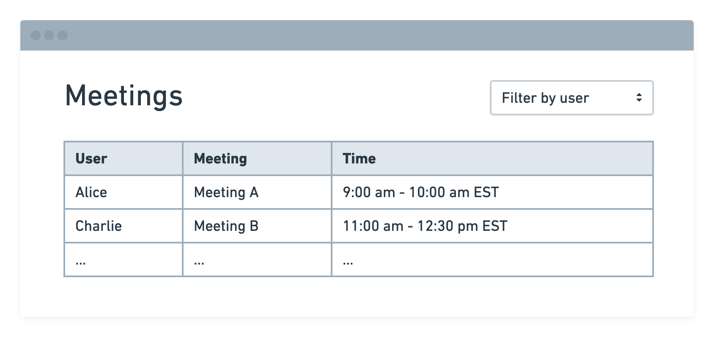

# Robin Front-end Interview Challenge

Hi there! Congrats on making it to the take-home portion of our interview process! We aim for this exercise to be enjoyable and brief, and welcome feedback. We also are happy to answer questions, so please don't be shy about reaching out to your point of contact at Robin should you find any parts of this challenge unclear or confusing.

## Getting Started

To get up and running:

1. Install NodeJS 16+. If you have `nvm` installed, run `nvm use` from the root of the repository.
2. Install dependencies:

   ```bash
   npm install
   ```

3. Boot up the test web server & front-end application:

   ```bash
   npm start
   ```

## Challenge

You will be building a simple web app that fetches data from a remote server, transforms it, and outputs some UI. In the end, your solution should match this wireframe:



Specifically, we ask that you:

### 1. Fetch remote data

Please make an HTTP request to fetch JSON from the bundled web server. This server is started automatically upon running `npm start` and is available at `http://localhost:8080/data`.

We've also [proxied](https://create-react-app.dev/docs/proxying-api-requests-in-development/) the server for your convenience, so you may fetch data in your client-side code by simply making a `GET` request to `/data`.

See the `User data` section below for more information about the shape of the JSON.

### 2. Display the data in a table

Please render a table of events for all users, but **only include events that start and end within each user's working hours**.

### 3. Add a user filter

Please create a filter with options for each user in the dataset. When a user is selected, only show events in the table for the selected user.

## Guidelines

When writing your solution, please:

- Timebox your effort to no more than 2 hours. Even if your solution is incomplete, we'd prefer that you feel proud of the code you did write rather than accept an incomplete or buggy solution.
- Use whatever tools or packages you'd like to help you write your solution. If you enjoy performing network requests with `axios` or styling tables with `styled-components`, feel free to install these libraries!
- TypeScript is enabled in this project and is available for use but it is **not required**! Write your solution in whichever language you're most comfortable with. If you prefer plain JavaScript, the easiest path forward is to create `.js` or `.jsx` modules instead of `.ts` or `.tsx` (and rename the existing `App.ts` to `App.js`, too).

## User data

The test data served by the bundled web server is array of objects where each object represents an individual user, with properties for:

- A list of meetings the user has on their schedule (`events` property)
- The hours in which the user works (`working_hours` property), and their time zone
- The user's ID and name (`user_id` and `user_name` properties)

```json
[
  {
    "user_id": 1,
    "user_name": "Alice",
    "working_hours": {
      "start": "09:00",
      "end": "17:00",
      "time_zone": "America/New_York"
    },
    "events": [
      {
        "id": 2,
        "title": "Meeting B",
        "start": "2019-01-01T09:00:00-0500",
        "end": "2019-01-01T10:00:00-0500"
      },
      ...
    ]
  },
  ...
]
```

## Extras

Optionally and only if you find yourself with extra time on your hands (we really mean it - these are not requirements), we'd love to see you show off your skills by adding any of the following:

- loading and error states
- accessible table considerations
- offline detection for users of the application
- the scaffolding to share selected user state across the application (pretend we were going to add more views to this application, and each view needed access to the filtered user - how could we achieve that? )

## Submitting the Challenge

If you have any notes you'd like us to review when we look over this project, please feel free to add them to the `notes.md` file at the root.

After completing this challenge, please email us your zipped solution!

We look forward to seeing your work and will get back to you promptly.
