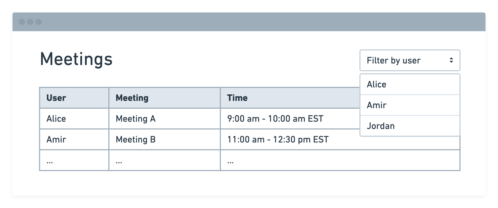

# Robin Front-end Interview Challenge

## Getting Started

To get up and running:

1. Install NodeJS 16+. If you have `nvm` installed, run `nvm use` from the root of the repository.
2. Create a new feature branch to store all your work:

    ```bash
    git checkout -b robin-challenge-solutions
    ```

3. Install dependencies:

   ```bash
   npm install
   ```

4. Boot up the test web server & front-end application:

    ```bash
    npm start
    ```

## Challenge

You will be building a simple web app that fetches data from a remote server, transforms it, and outputs some UI. In the end, your solution should look something like this wireframe:



Specifically, we ask that you:

#### 1. Fetch remote data

Please make an HTTP request to fetch JSON from the bundled web server. This server is started automatically upon running `npm start` and is available at `http://localhost:8080/data`.

We've also [proxied](https://create-react-app.dev/docs/proxying-api-requests-in-development/) the server for your convenience, so you may fetch data in your client-side code by simply making a `GET` request to `/data`.

See the `User data` section below for more information about the shape of the JSON.

#### 2. Create a UI

Now that you've fetched the data, please:

1. Render a table of events that start and end within each user's working hours
2. Create a filter that lets you filter events only by a specific user

### Guidelines

When writing your solution, please:

* Timebox your effort to 1-2 hours. Even if your solution is incomplete, we prefer that you feel proud of the code you did write over a complete solution with cut corners.
* Use whatever tools or packages you prefer to help you write your solution. If you like performing network requests with `axios` or styling tables with `styled-components`, go for it!
* TypeScript is enabled in this project and is available for use but it is **not required**! Write your solution in whichever language you're most comfortable with. If you prefer plain JavaScript, the easiest path forward is to create `.js` or `.jsx` modules instead of `.ts` or `.tsx` (and rename the existing `App.ts` to `App.js`, too).

### User data

The test data served by the bundled web server is array of objects where each object represents an individual user, with properties for:

* A list of meetings the user has on their schedule (`events` property)
* The hours in which the user works (`working_hours` property), and their time zone
* The user's ID and name (`user_id` and `user_name` properties)

```json
[
  {
    "user_id": 1,
    "user_name": "Alice",
    "working_hours": {
      "start": "09:00",
      "end": "17:00",
      "time_zone": "America/New_York"
    },
    "events": [
      {
        "id": 2,
        "title": "Meeting B",
        "start": "2019-01-01T09:00:00-0500",
        "end": "2019-01-01T10:00:00-0500"
      },
      ...
    ]
  },
  ...
]
```


## Submitting the Challenge

Please submit your response in the form of a git patch. This can be generated by running the following command. Please check to make sure all your changes are committed before generating the patch file.

```bash
git format-patch master --stdout > <yourname>-solutions.patch
```

We look forward to seeing your solutions!
